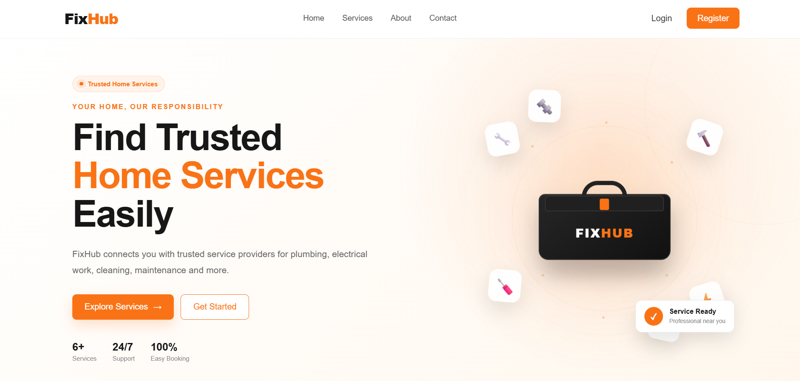
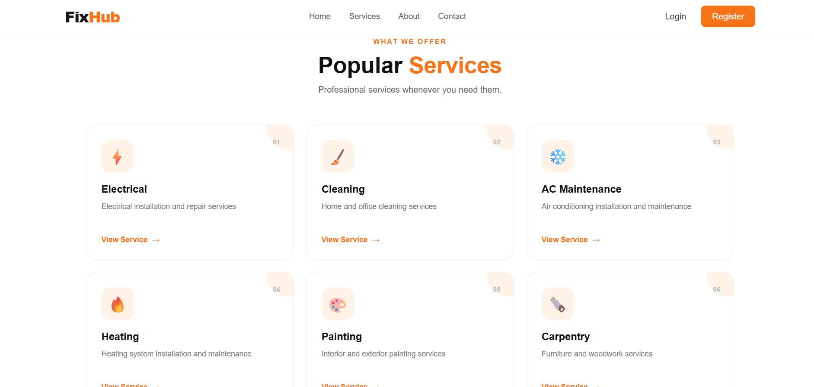
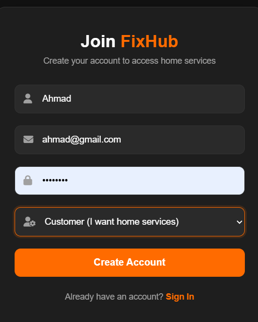
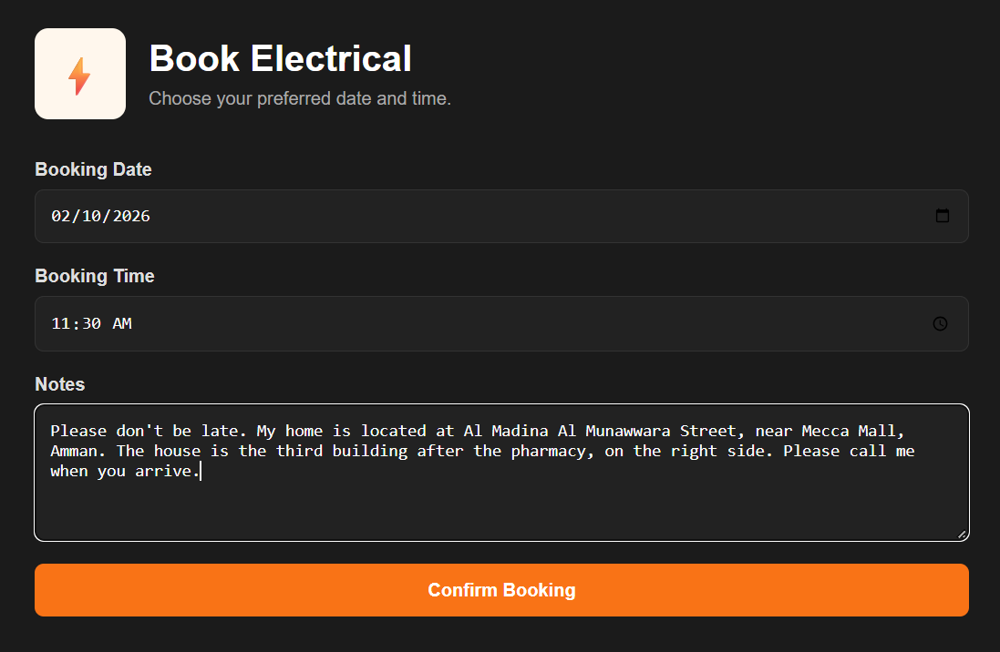
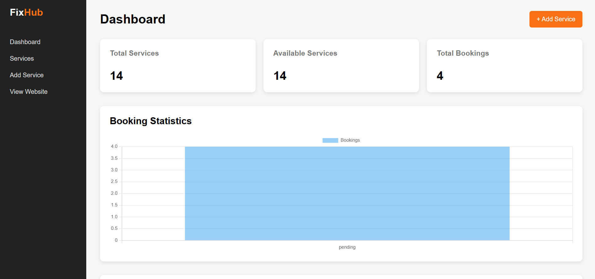
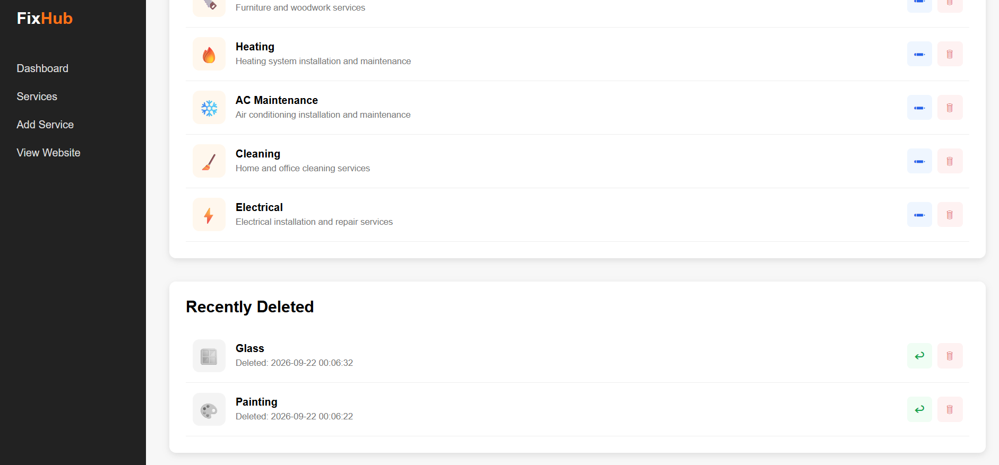

# FixHub

FixHub is a home services web application that helps users browse available home maintenance services and submit service requests such as plumbing, electrical work, cleaning, AC maintenance, painting, and more.

The project was built using **PHP, MySQL, HTML, CSS, and JavaScript**, with **Object-Oriented PHP** used to organize the application logic.

## Features

### User Features

* User Registration
* User Login and Logout
* Session-based Authentication
* Browse Available Services
* View Service Details
* Submit Service Requests
* Create Bookings

### Admin Features

* Admin Dashboard
* Add Services
* Edit Services
* Delete Services
* Restore Deleted Services
* Permanently Delete Services
* Manage Service Information

## Technologies

* PHP
* MySQL
* HTML5
* CSS3
* JavaScript
* Object-Oriented PHP
* PDO
* XAMPP
* Git & GitHub

## Project Structure

```text
FixHub/
│
├── admin/
│   ├── add_service.php
│   ├── delete_service.php
│   ├── edit_service.php
│   ├── index.php
│   ├── permanent_delete.php
│   └── restore_service.php
│
├── assets/
│   ├── main.js
│   ├── style.css
│   └── images/
│       └── services/
│
├── classes/
│   ├── Auth.php
│   ├── Booking.php
│   ├── Service.php
│   └── User.php
│
├── config/
│   └── Database.php
│
├── screenshots/
│   ├── admin-dashboard.png
│   ├── booking-successfully.png
│   ├── booking.png
│   ├── home-page.png
│   ├── login.png
│   ├── register.png
│   ├── services.png
│   └── soft-delete.png
│
├── booking.php
├── index.php
├── login.php
├── logout.php
├── register.php
├── service_details.php
└── .gitignore
```

## OOP Structure

The project uses Object-Oriented PHP to organize the main application responsibilities.

* `User.php` — Handles user-related operations.
* `Auth.php` — Handles user authentication and sessions.
* `Service.php` — Handles service-related operations.
* `Booking.php` — Handles booking and service request operations.
* `Database.php` — Handles the connection to the MySQL database.

## Admin Service Management

The admin section provides service management functionality, including:

* Adding new services
* Editing existing services
* Deleting services
* Viewing deleted services
* Restoring deleted services
* Permanently deleting services

The project uses **soft delete** functionality for services, allowing deleted services to be restored before permanent deletion.

## Database

The application uses **MySQL** as its database and **PDO** for database connectivity.

The database connection is handled through:

```text
config/Database.php
```

## Screenshots

### Home Page



### Services



### Login


### Register



### Booking



### Booking Successfully


### Admin Dashboard



### Soft Delete



## How to Run the Project Locally

### 1. Clone the Repository

```bash
git clone https://github.com/ayaalsaudi6-blip/FixHub.git
```

### 2. Move the Project

Place the project inside your XAMPP `htdocs` folder:

```text
C:\xampp\htdocs\FixHub
```

### 3. Start XAMPP

Start the following services from XAMPP:

* Apache
* MySQL

### 4. Create the Database

Open **phpMyAdmin** and create the required MySQL database.

Make sure the database name and connection settings match the configuration in:

```text
config/Database.php
```

### 5. Run the Application

Open the following URL in your browser:

```text
http://localhost/FixHub/
```

## GitHub

[View FixHub Repository](https://github.com/ayaalsaudi6-blip/FixHub)

## Author

**Aya Alsaudi**

[GitHub](https://github.com/ayaalsaudi6-blip)

[LinkedIn](https://linkedin.com/in/aya-alsaudi-3a60b733b)
